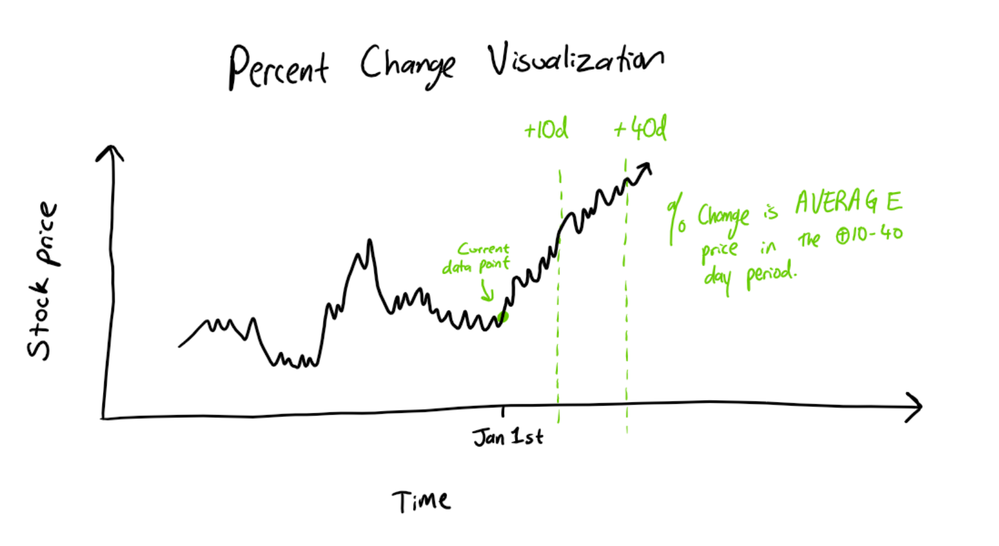

```{r setup, include=FALSE}

# knitr::opts_chunk$set(echo = FALSE)
```

```{r, message=FALSE, fig.height=4, fig.width=9}
library(tidyverse)
library(ggcorrplot)
library(dplyr)
library(timetk)
library(ggplot2)
library(gridExtra)
library(Metrics)
library(caret)
library(factoextra)
library(cluster)
library(caret)
library(rpart)
library(plotROC)
library(rpart.plot)
```

## 1. Title & Introduction

### **Classification and Prediction:** Predicting Stock Prices of AAPL Using Technical Indicators

By: Abhinav Bichal, Wei-Yu Chiang

### **a. Introduction**

Our data set contains variables of many different stocks with their prices, dates, volume, and a handful of stock indicators. These indicators are our predictor variables and are widely used to analyze stocks, such as the simple moving average, which takes a stock's average price in the past certain number of days, which results in a line. The outcome variable we will try to predict is the closing prices of stocks at the end of the day. All of our stock indicators were personally coded by us and applied to our list of stock that we obtained from yahoo finance. The data is constantly up to date as we are pulling information directly from yahoo finance through an API. We chose this topic because investing is important for retirement and personal financial goals. We wanted to investigate stock market investing with data and how well these stock indicators could predict price. We expect most of our indicators to be strongly correlated with the stock price because they are derived from them. We want to focus on the regression equations that we obtain to analyze how close we can predict the next day's price.

### b. Describing the dataset

We utilized the Yahoo Finance Python API to get up-to-date information on stock prices (under the package name, yfinance). There are 500 stocks selected under the SP500 as of April 2023, and of all these stocks, we retrieved the adjusted closing price information for stocks. The time period that the data is collected from ranges from Jan 1st, 2021 to Apr 20th, 2023. After obtaining closing price information, we used Python to calculate the relevant indicators that should correlate with stock market price increases/ decreases. Here is a list of indicators calculated from our Jupyter Notebook and the potential relationships one might expect:

-   **Simple Moving Average (10-day period) *longer term price movements***

    -   **relationship:** we speculate that stock prices that are upwards from the SMA line generally have a positive momentum, signaling that the stock might continue to uptrend. the converse is assumed for down-trending stocks.

-   **Exponential Moving Average (10-day period) *shorter term fluctuations captured***

    -   **relationship:** exponential moving averages have the same concept of the SMA line, where we attempt to predict general directional trends of stock prices. However, the EMA line places more emphasis on more recent stock price fluctuations, which provide better short-term information on stock price changes. We speculate that stock prices rising above the EMA line will indicate *earlier* that there is an upwards trend in stock price

-   **Relative Strength Index (14-day period averages)**

    

    (SOURCE: [What Is The Relative Strength Index (RSI) In Stocks? \| Nasdaq](https://www.nasdaq.com/articles/what-is-the-relative-strength-index-rsi-in-stocks))

    -   **relationship:** the relative strength index is a very common stock market indicator that describes whether a stock price is oversold or overbought based on the value given. Generally, RSI values of 30 or below indicate oversold stock prices, and RSI values of 70 or above indicate overbought. We speculate stock prices with a relatively low RSI value to be correlated with price increases. Vice-versa for high RSI values.

-   **Moving Average Convergence / Divergence**

    {width="490"}

    (SOURCE: [Moving Average Convergence Divergence (MACD) - αlphαrithms (alpharithms.com)](https://www.alpharithms.com/moving-average-convergence-divergence-macd-031217/))

    -   The MACD line is another common indicator in stock market technical analysis. Generally speaking, when the signal MACD line (which is the shorter 9-day period subtracted by 26-day period of the exponential weighted means) crosses from below to above the MACD line, we consider the stock to begin an upwards movement. When the MACD signal crosses below the line, the stock is considered to go downwards.

    -   **relationship:** we speculate that the distance of MACD signal \* slope correlates with whether the stock price increases or decreases over a certain period of time.

-   **MACD-NEW (Engineered Variable Based off of MACD Values)**

    

    -   This is a variable that we engineered in Python, and its purpose is to act as a "signal" that gives more information on whether the macd signal line is near the actual macd. This is critical for us to determine the "when" for a stock being a good buy or not

    -   The MACD-NEW should be correlated with the percent change in price, such that a positive value of this should generally indicate an upwards movement of price, and a negative value generally indicates a downward motion. However, the signal we made can be a bit "messy" since there are a lot of moving factors that go into stock prices. (we will visualize this signal in the assignment to better represent what's going on). **relationship:** closer distance means higher signal intensity, and a negative slope means that differences are closing in. Therefore, negative MACD-NEW values should be correlated in theory to upwards price movements.

    -   One thing to note here is that the slope and tanh activation function may be modified to get different sorts of MACD-NEW signals, and that is something that we should try to tweak in the future to get cleaner signal data.

-   **Sentiment Score (r/stocks subreddit mentions of AAPL - we didn't use it but it is interesting)**

    -   This is top Reddit comments that mention the keyword "AAPL", and we ran VADER sentiment analysis to get a compound sentiment score for a particular stock on that particular day. The sentiment scores were not very useful so we decided not to include this in our data, since the dates for sentiment scores were not consistently after each other and we lost a lot of data for chronological stock prices in this way. **relationship:** we do not expect there to be any significant relationship with sentiment scores because Reddit data is not very structured/ organized for stocks.

-   **Percent Change in 2 Week Period (Numeric Response Variable)**



This is a visualization of what our percent change calculation looks like. Because the technical indicators that we are using are intended to capture more long term data, we consider a "future" stock price to be reflected by a period of 30 days after a certain number of interval days. The +10 day time and 30 day window seemed to be the best estimate for our stock price predictions because it generally captures the best summary of our technical indicators for the long term future. We tried other intervals (including price the day right after), but longer term capture of future stock prices seem to be the best performing for our model.

We expect that this variable is relatively more correlated with the technical indicators such that higher percent changes correlate with lower RSI values, and lower MACD also correlate with higher percent changes. We also hope to see that our MACD-NEW, which is a calculation of our macd signal differences, will have a negative relationship to correlate with higher percent changes.

-   **Good Buy (Categorical Response Variable)**

    -   This is the variable that we coded into our data set, and it basically distinguished good stocks as stocks that **increase by at least 3%** in the period of time defined by percent change. All other stocks are considered "bad stocks"

    -   We made this categorical variable for our classification algorithm, and this threshold evenly divides our stock prices as good or bad, which means that we have roughly a 50/50 split of representation of this variable in our dataset.

    -   We predict that this variable also has the same correlation relationships as "percent change", and that is because we hope to see that oversold stocks mean that there will be a higher percent change, and vice-versa.

### c. Research Questions

**Wei-Yu's Research Question:**
How accurately can we predict the stock price in two weeks with the current day\'s stock price and indicators using linear regression?

**Abhinav's Research Question:**

Given that a good stock is a price that increases by at least 3% in the period of time defined by "percent change", can we classify/ separate stocks as being a good or bad buy based on the technical indicators using a classifier?

## 2. Exploratory Data Analysis

### a. Reading in the Data (Stock Adjusted Closing Prices & Sentiment Scores)

The data is derived from Yahoo Finance and we calculated the technical indicators in Python. Sentiment data is derived from Vader Sentiment Analysis scores off of Reddit data in "r/stocks". The stocks are classified in this project as either being a "good buy" or not. To be a "good buy" stock, the price must increase by at least 3% in percent change period. If not, the stock is not considered to be a good buy.

```{r}
# reading in the data given to us
aapl <- read_csv('aapl_stock.csv')

# creating the datetime columns for convenience in R ggplot functions
aapl <- aapl %>%
  separate(col = 'Date', into = c('year', 'month', 'day'), sep='-') %>%
  unite(date, c('year', 'month', 'day'), sep = '-')
# casting to date type
aapl$date <- as.Date(aapl$date)

# renaming some columns to be consistent in styling
aapl <- aapl %>%
  na.omit %>%
  rename('adj_close' = 'Adj Close',
         'macd_new' = 'MACD-NEW',
         'percent_change' = 'Percent_Changes',
         'macd_signal'='MACD-SIGNAL')
names(aapl) <- tolower(names(aapl))

# removing the unessecary columns from the dataframe
aapl <- aapl %>%
  select(-close, -high, -low, -open)

# *** classifying stocks as either a good buy or not, given the threshold of being able to increase by at least 3 percent
aapl <- aapl %>%
  mutate(good_buy = ifelse(percent_change > 3, T, F))


# the sentiment scores will be a separate dataset, since
# we actually do not have values for every day in the sentiment scores to do a full in-depth analysis of its stock prices
aapl_sentiment <- read_csv('sentiment_aapl.csv')

aapl_sentiment <- aapl_sentiment %>%
  select(-body) %>%
  group_by(date) %>%
  summarize(sentiment_score = mean(sentiment_score))

# merging sentiment scores with the aapl dataset, and we will be using this for using models that will calculate sentiment scores but for visualizing stock data, we will use the original dataset 
aapl_sentiment <- inner_join(aapl, aapl_sentiment, by='date')

# here, we are mutating the difference for EMA and SMA scores because that is what really matters for this analysis
aapl_sentiment <- aapl_sentiment %>%
  mutate(sma_diff = adj_close - sma, ema_diff = adj_close - ema) %>%
  select(-sma, -ema)

# one last thing that we want to keep account of is the difference between the simple and exponential moving averages. this is because having both SMA and EMA as data inputs is quite redundant, but knowing the difference might tell us whether the stock price is beginning to diverge significantly or not
aapl_sentiment <- aapl_sentiment %>%
  mutate(ema_sma_diff = ema_diff - sma_diff)

# selecting out the bad variables from aapl
aapl <- aapl %>%
  mutate(sma_diff = adj_close - sma, ema_diff = adj_close - ema) %>%
  select(-ema)

aapl <- aapl %>%
  mutate(ema_sma_diff = ema_diff - sma_diff)

head(aapl_sentiment)
```

### b. Create a Correlation Matrix

We will consider all variables for the correlation analysis in order to see whether stocks are a good buy or not. We removed the date, ticker, and adjusted close values because these data points are not generally correlated with any indicators, since their values may be arbitrary. We did include the two macd signals because they revealed to be correlated in some significant way with whether the stock was a good buy, and that might lead us to some interesting findings. However, it is important to note that the macd signal and macd line will naturally be correlated to each other since they do generally follow each other, but we should ignore this fact in this graph.

```{r, message=FALSE, fig.height=4, fig.width=9}
#demonstrating correlation of variables with only Apple stocks
aapl_sentiment %>%
  select(-date,-ticker, -adj_close, -ema_diff, -sma_diff) %>%
  cor %>%
  ggcorrplot

# NOTE: for our actual model analysis, we did not include sentiment score because adding this variable deletes some crucial dates from the stock market prediction and means that our cross validation cannot be run chronologically, which means that seasonal stock market data reflections are not possible to be made 
```

### **Correlation Matrix**

The highest correlated variables are macd and macd-signal, but that is expected because of the fact that these lines are similary calculated. Looking past that, we want to pay attention to "good_buy", because that is the variable that tells us whether the stock price increases by over 3% in the future period. When taking a look at this, we notice that a stock being a good buy is relatively more corrrelated with "macd", "macd_signal", and "percent_change" (this is obviously the most correlated since that indicates the percent change". There is a slight positive correlation with "macd_new", which is our own calculated indicatior that tells us the "strength" of a macd line crossing or not. Another variable to consider is the sentiment score. This score will calculate the sentiment of users on Reddit about a particular stock on a certain day. We notice that this variable is not very correlated with any others, so that is not a good sign for our prediction model.

Overall, the highest correlations are present with MACD indicators and whether a stock is a good buy, and the lowest correlation is generally between any pair of indicators that are used with the sentiment scores.

# **Visualizations of Relationships across the Variables**

### **a. Wei-Yu's Visualizations**

#### i. Stock Price, Relative Strength Index, and Average Price of Stock Two Weeks from the Current Day

```{r, message=FALSE, fig.height=4, fig.width=9}
# we are plotting the RSI values for the first 100 days of stock market data
aapl_price <- aapl %>%
  slice(1:100) %>%
  ggplot()+
  geom_line(aes(x = date,y=adj_close)) + 
  labs(y = 'Adjusted Close')

aapl_rsi <- aapl %>%
  slice(1:100) %>%
  ggplot(aes(x=date,y=rsi)) +
  geom_line() + 
  geom_hline(yintercept = 70, linetype='dashed', color = 'orange') +
  geom_hline(yintercept = 30, linetype='dashed', color = 'orange') +
  labs(y = 'RSI')

percent_change <- aapl %>%
  slice(1:100) %>%
  ggplot(aes(x = date, y = percent_change)) +
  geom_line() +
  geom_hline(yintercept = 0, color = 'red') + 
  labs(y = 'Percent Change')

grid.arrange(aapl_price,aapl_rsi,percent_change, ncol=1)
```

**Relative Strength Index**

The RSI is separated from the graph because it is calculated from the percentage gain/loss of stock prices. Typically, when the RSI is above 70 then the stock is overbought and when the score is below 30 it is oversold. People usually want to sell stocks when it is overbought and buy when the stocks are oversold. Here we can see instances of when the RSI score is very high and is followed with a downward trend because it is overbought. One interesting pattern to notice is that whenever the RSI value is greater than the threshold of 70, we notice that 2 weeks from that current day, the stock price generally is negative in value. Whenever the RSI is below 30, the stock price 2 weeks from that day is actually in the positive. This is a good sign that our indicators are working and that RSI may allow us to determine when stock prices are going to increase or decrease in the future.


#### ii. Simple Moving Average

```{r, message=FALSE, fig.height=4, fig.width=9}
aapl %>% 
  slice(0:300) %>%
  ggplot() +
  geom_line(aes(x=date,y=adj_close)) +
  geom_line(aes(x=date,y=sma),color='red')

# we visualized SMA here, but we dont need it anymore since "sma_diff" is basically more valuable than SMA for our future predictions 
aapl <- aapl %>%
  select(-sma)
```

**Simple Moving Average**

The simple moving average is calculated based on the prices of previous days. It computes an average and overlaps onto the line graph of price because it is specific to that price. This tool is used to look at upward and downward trends as it allows people to see how the price is performing based on an average. For example, around 2021-07, price (black line) stays above the SMA (red line) for many days because it keeps performing better than its average. We can watch out for when the price crosses the SMA which could indicate price changing directions.

### **b. Abhinav's Visualizations**

#### iii. Good Buy Stocks with MACD-NEW

Because we did create our own technical indicator from MACD signals, we want to see if this indicator has any meaning or if there is simply just too much noise for the indicator. In order to do this, compared the distribution of the MACD-NEW values with whether a stock is a good buy or not. To also understand this in terms of other technical indicators, we also added a couple more variables in the graph to see what variables truly are better indicators for telling us if a stock is a good buy or not.

```{r, message=FALSE, fig.height=4, fig.width=9}
# making 3 similar box plots for side-by-side visualization 
md_new_plot <- aapl %>%
  ggplot(aes(x = macd_new)) + 
  geom_boxplot() +
  facet_wrap(~good_buy) +
  labs(title = 'Good buy (>= 3% increase) vs. Indicators') + 
  ylab('MACD-NEW')

rsi_plot <- aapl %>%
  ggplot(aes(x = rsi)) +
  geom_boxplot() +
  facet_wrap(~good_buy) + 
  ylab('RSI')

md_plot <- aapl %>%
  ggplot(aes(x = macd)) +
  geom_boxplot() +
  facet_wrap(~good_buy) + 
  ylab('MACD')

grid.arrange(md_new_plot, md_plot, rsi_plot, ncol=1, nrow=3)
```

Except for the MACD singal having a lower median value below 0 for good buy stocks, the technical indicators seem to have no real signficant difference in population distributions for whether a stock is a good buy or not. However, when we do take a look at stock market data, we notice that these indicators are indeed related to price movements of stocks and future movements as well. One reason to explain why this happens is because stock market prices are very prone to fluctuation, and there are plenty of different sorts of market conditions (bull vs bear runs) for stock prices. These fluctuations ultimately mean that stock market indicators cannot be the final verdict for generalizing stock price movements for *any* time of year. And this is actually very true if we take a look at one more visualization:

```{r, message=FALSE, fig.height=4, fig.width=9}
price <- ggplot(aapl %>% slice(100:200), aes(x = date, y = adj_close)) +
  geom_line() + 
  labs(title = 'Stock Price (Above) and MACD-NEW (Below)')

md_new <- ggplot(aapl %>% slice(100:200), aes(x = date, y = macd_new)) +
  geom_line() +
  geom_hline(yintercept = 0, color = 'red')

# taking a look at shorter term price data... we can see that there is a lot of signal noise in the data, but higher values of signals generally occur when stock price goes down, and vice-versa for lower values
grid.arrange(price, md_new, ncol=1)
```

#### iv. RSI and MACD Relationship with Price Changes

Taking the two most correlated variables in the correlation plot, we can inspect the relationship between RSI, MACD, and whether the stock was a good buy along with the corresponding percent change of that stock price.

```{r, message=FALSE, fig.height=4, fig.width=9}
# checking to 
aapl %>%
  mutate(good_buy = factor(good_buy, levels = c(T, F), labels = c('GOOD BUY', 'BAD BUY'))) %>%
  ggplot(aes(x = rsi, y = macd, color = percent_change)) + 
  geom_point(aes(shape = good_buy)) +
  geom_smooth(method = 'lm') + 
  labs(title = 'RSI and MACD Lines for Good and Bad Stock Purchases',
       x = 'Relative Strength Index',
       y = 'Moving Average Convergence/ Divergence') + 
  theme_minimal() + 
  labs(shape = 'Type',
       color = 'Percent Change') +
  annotate("text", x = 75, y = -4, label = "Good Buy Region", color = "blue", size = 5) +
  annotate('text', x = 16.5, y = 4, label = 'Bad Buy Region', color = 'red', size = 5)


```

From the visualization above, we realize that there is actually a very interesting trend of RSI values and MACD! As RSI increases, we notice that MACD also increases, and that makes sense because both indicators are calculated using exponential weighted means that are related to each other. However, one trend that is interesting is that above this linear regression line of RSI and MACD, we mostly have "BAD" stocks, and below this line, we mostly have "GOOD" stocks. This means that above the regression line we notice stocks that generally go down and below are stocks that go up.

This is a complicated relationship, so here is a bullet point list of each interaction that is going on here:

-   lower MACD under a relative RSI value generally have better stocks to buy, why?

    -   because lower MACD lines typically indicate that a stock is also being oversold, and if a stock is oversold, it will generally rise in price

    -   The same argument goes for higher MACD lines

-   MACD is correlated with RSI in a general upwards trend, why?

    -   same point as above, but lower lines typically represent oversold stocks, and that also corresponds to lower RSI values, which are ALSO oversold stocks!

-   GOOD buy stocks are below the regression line, and BAD buy stocks are above, why?

    -   For any given RSI value, we know that being lower (around 30) generally means that stock prices have a tendency to increase. Now, with MACD values which are ALSO lower, we have a consensus on two types of indicators. Because both indicators agree on this stock being oversold, we have a higher probability that the stock price is indeed oversold, meaning that the price is MORE LIKELY to tend upwards!

    -   So for any given RSI value that is low, an even lower MACD value (below regression line) more strongly indicates that the stock is being oversold. The stock is more likely to tend upwards due to this, hence we see more stocks as a good buy underneath this line.

## 3. Prediction and Cross-validation

### **a. Wei-Yu's Prediction**

#### i. Predicting Stock Prices 2 Weeks From the Current Day Using a Linear Model

For predicting stock prices, we are predicting prices 2 weeks from

```{r, message=FALSE, fig.height=4, fig.width=9}
# predicting the percent change of stock prices given the following indicators
fit_lin <- lm(percent_change~ema_diff + rsi + volume + macd + macd_signal + macd_new + sma_diff + ema_diff, data = aapl)

# summary of the model: volume, macd, and macd_signal are the most significant variables for prediction for this linear model, that is something interesting
summary(fit_lin)

# get predicted price change % 2 weeks from the current date
pred_lin <- aapl %>%
  mutate(predictions = predict(fit_lin)) %>%
  select(percent_change,predictions,date)

# plot actual price change vs. predicted price change in 2 weeks 
pred_lin %>% 
  ggplot() +
  geom_line(aes(x=date,y=percent_change)) +
  geom_line(aes(x=date,y=predictions),color='red') +
  labs(title = 'Actual Percent Change Over The Next Month vs. \nPredicted Percent Change (Black = Actual, Red = Predicted)')


# the predicted error for new data being seen, the Root mean squared error
rmse(pred_lin$percent_change,pred_lin$predictions)

# the R^2 statistic is pretty low, meaning that only 19% of the variance of stock prices are explained by the model's performance
summary(fit_lin)$r.squared
```

**(First 60 days of graph above)**

for a more detailed view of a certain period of days:

```{r, message=FALSE, fig.height=4, fig.width=9}
# slicing the graph for a smaller window
pred_lin %>% 
  slice(80:160) %>%
  ggplot(aes(color = 'Type')) +
  geom_line(aes(x=date,y=percent_change, color = 'black')) +
  geom_line(aes(x=date,y=predictions),color='red') +
  geom_hline(yintercept = 0, linetype='dashed', color = 'orange') + 
  scale_color_manual(name = 'Type', 
                     values = c('Actual Price' = 'black', 'Predicted' = 'red'),
                     labels = c('Actual Price', 'Predicted')) +
  labs(title = 'Actual Percent Change Over The Next Month vs. \nPredicted Percent Change (Black = Actual, Red = Predicted)')
  
```

#### ii. Cross Validation of Linear Regression Model

**We were told to use cross validation for our predictions, but we also compared this with the time slice validation method because:**

-   stock market conditions change over time: sometimes, we might have an upwards trend in the market, and other times the trend may be downwards/ stagnant

-   seasonal changes to stock market conditions l

```{r, message=FALSE, fig.height=4, fig.width=9}
# we are using train control here to make slices based on chronological order
TimeControl <- trainControl(method = 'timeslice',
                            initialWindow = 45,
                            horizon = 10)

foldControl <- trainControl(method = 'cv', number = 7) # 7 fold cv


# training cross validation model
lin_cv <- train(percent_change~ema_diff + rsi + volume + macd + macd_signal + macd_new + sma_diff + ema_diff, data = aapl, method = 'lm', trControl = TimeControl)

lin_cv_fold <- train(percent_change~ema_diff + rsi + volume + macd + macd_signal + macd_new + sma_diff + ema_diff, data = aapl, method = 'lm', trControl = foldControl)

lin_cv
lin_cv_fold
```

**Time-Series Cross-Validation**

Our cross-validation method had to account for our data being a time-series. We cannot partition our data and scramble them up as there needs to be a certain order since we are accounting for time. This method provides that solution by doing a rolling window of training and testing data. The initial window parameter is set to 45 here which means the first 45 data points are used for training then the 10 data points after that is used for testing.

**Linear Regression CV Results**

The results above do not provide accuracy because we are attempting to predict a numeric variable and not a categorical one. Instead, we can look at the RMSE of 8.005, which is very high pertaining to this scenario. *Note that results may vary depending on the seed set before running this cross validation. T*his means, on average, our weighted error between actual and predicted is off by about 7. The R-Squared value is not a very favorable measure in determining the strength of our model because we are dealing with factors such as trends and non-stationary values that grow over time.

**Over fitting**

These results do not seem to over fit because the stock market is something very hard to predict as prices are affect by numerous reasons that do not just pertain to mathematical indicators. In fact we could be under fitting as our model does not do a good job of predicting and this could be due to the model we used to fit out data. A potential better alternative could be polynomial regression as it allows for more flexibility of price movements which is advantageous if you look at how stock prices move so sporadically.

### b. Abhinav Bichal's Predictions

#### iii. Predicting Whether a Stock is a Good Buy or Not Using Indicator Data

```{r, message=FALSE, fig.height=4, fig.width=9}
# creating the decision tree here
stock_tree <- rpart(good_buy ~ volume + rsi + macd + macd_new + sma_diff + ema_diff, data = aapl)

# taking a look at the decision tree for a good or bad stock price prediction result
rpart.plot(stock_tree)
```

```{r}
prediction_results <- data.frame(predictions = predict(stock_tree, aapl), actual = ifelse(aapl$good_buy == T, 1, 0))

# the ROC curve does provide some predictive power/ value for a prediction of a good stock buy/ sell. 
ROC <- prediction_results %>%
  ggplot() +
  geom_roc(aes(d = actual, m = predictions), n.cuts = 10)

ROC 
```

```{r}
# calculating the area under the curve
paste('area under the curve: ', calc_auc(ROC)$AUC)

# we got an excellent ROC score! An ROC ascore betweeen 0.8 - 0.9 is a great number to get for prediction of stock prices (whether we have a good or bad stock purchase)
```

Reflection of AUC score: We got an excellent AUC score, but we should also keep in mind that this AUC score is calculated on the training data, which we already seen before. The model is good at training on itself, but may be prone to overfitting on its own data. In order to determine the general performance of our model on other datasets, it is worth performing cross-validation (which is the next part).

#### iv. Performing Cross Validation with Decision Trees

comparing

```{r}
# we are using train control here to make slices based on chronological order
TimeControl <- trainControl(method = 'timeslice',
                            initialWindow = 200,
                            horizon = 20)

foldControl <- trainControl(method = 'cv', number = 7) # 7 fold cv


# training cross validation model
rpart_cv <- train(good_buy~ rsi + volume + macd + macd_signal + macd_new + sma_diff + ema_diff, data = aapl %>% mutate(good_buy = as.factor(good_buy)), method = 'rpart', trControl = TimeControl)

rpart_cv_folds <- train(good_buy~ rsi + volume + macd + macd_signal + macd_new + sma_diff + ema_diff, data = aapl %>% mutate(good_buy = as.factor(good_buy)), method = 'rpart', trControl = foldControl)

# taking a look at the cross-validation results
rpart_cv

rpart_cv_folds
```

**Summary:** The results of the classification model decision tree using a 7 fold cross validation score is shown above. The model is built using 500 stock market data points and 7 predictor variables. The cross validation model's best accuracy was close to the time series model accuracy, with around 64% accuracy, compared to only 62% for the other model type. The average performance for both sorts of cross validation models is around 60% which is a good sign. We also did a time series comparison of 40 for window size and 10 for horizon, but the model accuracy was very low, near a 50% level, and that is not included in these results.

Unlike the regression model, this 7 fold cross validation score ended up resulting in similar performance to the best time series cross validation that we found, and that is an interesting observation that reveals to us that the classification model works better with more data input to it. Also, the model works better with more complex data, as we realize that the highest performing one has a cp value of the lowest level o 0.0426, which indicates that the decision tree is more complex than the other sorts of cross validation that it was trained on.

Now, to answer the questions on the document:

-   are there any signs of overfitting?

    -   There is a sign of overfitting. The model performs surprisingly well when trained on all data points and calculating the ROC of itself. The classification is not the best, but the model is noticing some patterns that are worth looking into later on.

    -   we might want to consider including more ticker symbols in the future for better predictions and higher variance in the future to try to fit stock market data better, but bringing in more data might also add on to the noise in our stock market data.

### c. Comparing Decision Trees to Linear Regression - Which Model is More Reliable?

Comparing the two models, we would go with linear regression as the better one because of it's lower RMSE score. The lower the score means the closer our predictions come to the actual data. However, the linear regression model does struggle to perform well when trained on the cross validation data for random sampling, and that indicates that the regression model is better performing on data that is chronological/ around the same time period. This may be reflected by changing market conditions that alter the behavior of stock prices relative to their indicator values, and linear regression may only be effective when looking at windows of time at once.

## 4. Dimensionality Reduction

**Additional Data Preparation**

In order to perform PCA, we must do the following steps:

1.  prepare the data by centering and scaling the data
2.  performing PCA using prcomp() on the prepared variables
3.  selecting the number of principal components to make an explained variance plot
    1.  we generally want to select PCs that correspond to 70-100% of the model variance if we want to generalize our observations
4.  find the PC scores and visualize the first two PCs

```{r}
# change volume data type as a double
aapl$volume <- as.double(aapl$volume)

# now, only select the numeric variables and remove the unecessary data. NOTE: percent change is also being taken out because this is not something that is known in real time, and therefore that is a prediction variable that we should NOT consider.
aapl_scaled <- aapl %>%
  select_if(is.double) %>%
  select(!(1:2)) %>%
  select(-percent_change) %>%
  scale %>%
  as.data.frame

# taking a look at how the dataset looks like so far...
head(aapl_scaled)
```

```{r}
# simply perform PCA on this numerical dataset now
pca <- aapl_scaled %>%
  prcomp

# we realize that much of the model variance is retained at around 70%
fviz_eig(pca, addlabels = TRUE, ylim = c(0, 60))
```

**We will keep the first two principal components for total of 71.6% explained variance. These are the explained variances for our first two principal components.**

```{r}
# PCA of AAPL Stock Indices
fviz_pca_ind(pca) 
```

## 5. Clustering

### a. PAM Clustering and Reason Why We Chose This Method

**PAM Clustering**

We decided to use the PAM clustering algorithm because PAM clustering is less sensitive to outlier data because the medioid points are actually just the points themselves. If we were to use K-means, outliers could skew the clustering towards either extreme ends of our data, which is not what we would like.

```{r}
fviz_nbclust(aapl_scaled, pam, method = "silhouette")
```

**We will choose to use two clusters.**

Two clusters seem to be ideal due to the high dropoff of silhouette width after 2 clusters.

```{r}
pam_results <- aapl_scaled %>%
  pam(k = 2)

fviz_cluster(pam_results, title = 'PCA of AAPL Adj Close Stock Prices Based on Indicator Data \n(71.6% Explained Variance)')
```

### b. Summary Statistics of PAM Clustering and Observations of Clusters

#### Summary statistics of our two different clusters

```{r}
# we can get the summary of these clusters by grouping by these specific clusters given to us and talking about their relevance 
aapl %>%
  mutate(cluster = as.factor(pam_results$clustering)) %>%
  group_by(cluster) %>%
  summarize_if(is.numeric, mean, na.rm = T)
```

```{r}
aapl %>%
  mutate(cluster = as.factor(pam_results$clustering)) %>%
  group_by(cluster) %>%
  summarize_if(is.numeric, mean, na.rm = T) %>%
  select(cluster, rsi, macd, percent_change)
```

The PAM clustering actually gave us some very interesting data:

-   Cluster 1 is grouped with OVERSOLD stocks

    -   RSI value average is around 30, which is a standard value threshold for oversold stocks

    -   MACD value is negative, which is also indicative of oversold stocks

    -   percent change is near 3%, which is close to our threshold of "good buy" stocks!

-   Cluster 2 is grouped with generally OVERBOUGHT stocks

    -   RSI value is near 70, which is the standard value of overbought stocks

    -   MACD is positive, which is also in conesnsus with a high RSI value

    -   The percent change of stock price is near 0.5 - 0%, which indicates either rapid fluctuations or generally decreasing stock prices.

    -   For this sort of cluster, we cannot be sure that stock prices are a good buy or not, so they are not classified to be as such either!

**The most exciting result is that the RSI values are close to the actual standard RSI value threshold for stocks at 30 and 70 for oversold and overbought stocks, respectively. This is a good sign that our model is on the right track and that the technical indicators are doing the right job. Also this is a good indicator that our response variable is also accurately captured in the long term trends of price if it's associated with RSI and MACD values that make sense.**

## 6. Discussion

**Wei-Yu's Research Findings**

Q: How accurately can we predict the stock price in two weeks with the current day's stock price and indicators using linear regression?

We could not accurately predict the stock price as the weighted average error of our results was about 7 based on the RMSE. In this scenario, 7 is a large effect, especially since we measured in percent change. We can see our prediction model visualized in section 3, part a. We can see that the predicted prices do not come close to actual prices often, so the value of our RMSE seems accurate. My findings have definitely piqued my interest in trying other models and finding more variables if I was to tackle this challenge again.

**Reflection**

Wei-Yu's Research Question (Linear Model): From our research we tried to create a model that captures long-term trends of stock prices. The most notable predictors were the MACD and Volume in our linear regression model as their p-values were significant at 5% level when we performed the linear regression. We can see in our data set that we have a variable 'sentiment_score' that we did not include as predictor variable because the API that we used did not allow us to grab enough data. We still included in our visualization to see the potential relationships under the correlation plot.

Abhinav's Research Question (Classifier): From the classifier decision tree results, we realized that the models perform decently well for stock market data, with a cross validation score accuracy hovering around 60%. One interesting observation is that we realized that from both cross validation and also the time series validation, the classifier model performs relatively well and is able to get around the same accuracy. This is in contrast to the linear regression model because the regression model does not perform very well on the cross validation data (with an R^2^ of 0.17, which is significantly less than the time series CV of 0.52. This model is generally okay with new sorts of data as shown by the cross validation scores, and for this research question we can say that the classifier model can actually identify whether stocks are a good buy of gaining over 3% in value over the month period defined by "percent change"

**What was challenging?**

Our project became more difficult than expected because we did not realize how different of an approach we had to take when analyzing time series. Our visualizations needed a 'date' data type to be displayed properly. We needed to transform our stock price variable to account for future values and predict based on that instead of predicting on 'stationary' data. Also, to account for fluctuating variance in prices, everything had to be a relative measurement otherwise, we would not be holding the effects of time fixed. The same concept was also applied to our predictor variables. When it came to cross-validation, again, we faced the problematic attributes of time series. Normal cross-validation scrambles up all the data points, which is troublesome because we can not mix up future and past data points. This is because stock market conditions are very variable depending on the time of year, and this mixed sampling of cross validation will not provide us with high quality data for predicting stock prices in the same time period. The most challenging part was discovering these situations and accommodating our data to have valid results.

Another difficult aspect of this project is to assemble these stock market indicators by ourselves. There is a lot of freedom to try different sorts of variables, intervals, and calculation methods to get stock market indicators, and there is definitely no one perfect way of gathering indicator data. Also, we had to rely on an API, which gave us the problem of having too much data. We had to shorten our search to only one sort of ticker symbol for the purposes of this project.

Overall, here is a general summary of our model and the variables that are involved with it:

-   our models capture general trends of stock prices for this particular case

-   MACD and RSI values are significant predictors for linear regression

-   Our decision tree classifier favors more complex structure and is relatively good at predicting whether a stock is a good buy or not (AUC \~ 0.89).

-   Sentiment Scores are almost worthless for our stock market analysis, since they are not significantly correlated with any of the other variables

**Acknowledgements**

Abhinav Bichal (data preparation, classification, cross validation)

Wei-Yu Chiang (linear regression, clustering, cross validation)

*About yfinance data and Python usage:*
During the course of our project, we used Python for data collection under Yahoo Finance. Both members of the group learned Python through self teaching and also through college classes that go over data science concepts in Python (Abhinav learned Python through Big Data in Biology FRI stream, and Wei-Yu through online classes going over data science in finance). Despite our different backgrounds, we were able to collaborate effectively using our combined skills and experience. Python packages of Pandas and scikit were used to manipulate and engineer stock market data.

For more information on how we collected data, here is our GitHub link:

[thabat12/stock_predictions (github.com)](https://github.com/thabat12/stock_predictions/tree/master)

